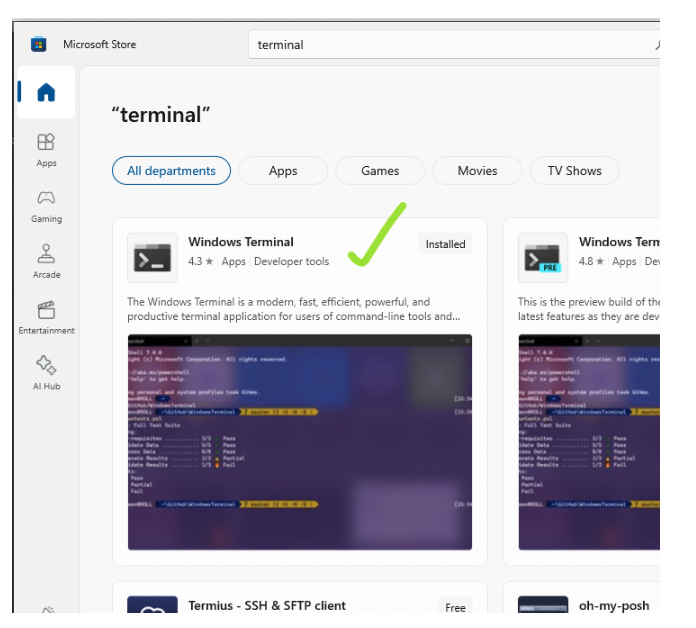
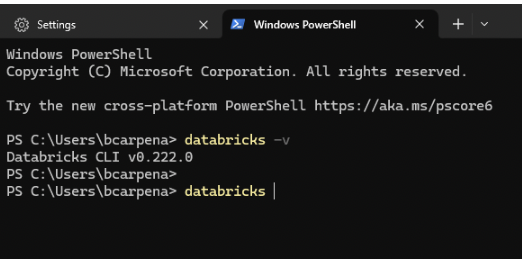
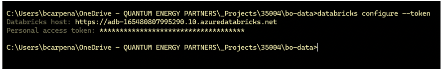
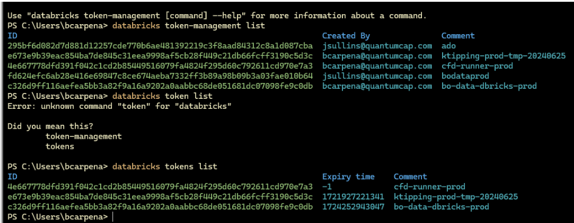

# Collection of databricks-cli commands

## Install terminal via winget
- Reference: https://docs.databricks.com/en/dev-tools/cli/install.html#winget-install

## Install Databricks CLI 
- `winget install Databricks.DatabricksCLI`
- Verify using: `databricks -v`

## Connect to Databricks via CLI
- `databricks configure --token`

## List tokens used in the tenant
- List all tokens in tenant: `databricks token-management list`
- List my created tokens: `databricks tokens list`

