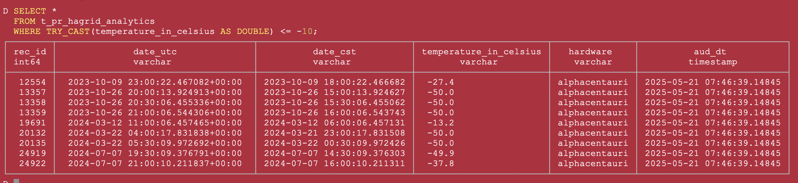

# All duckdb
> - SQL statements and notes on duckdb

## get temperature <= -10
> AI reference: https://chatgpt.com/c/682dcddb-40f8-800c-83bb-95639dee205b

SELECT * FROM t_pr_hagrid_analytics
WHERE TRY_CAST(temperature_in_celsius AS DOUBLE) <= -10;

