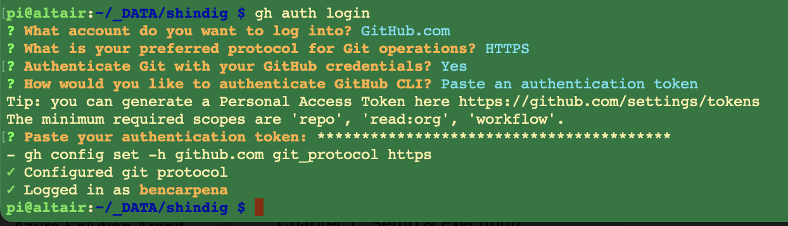
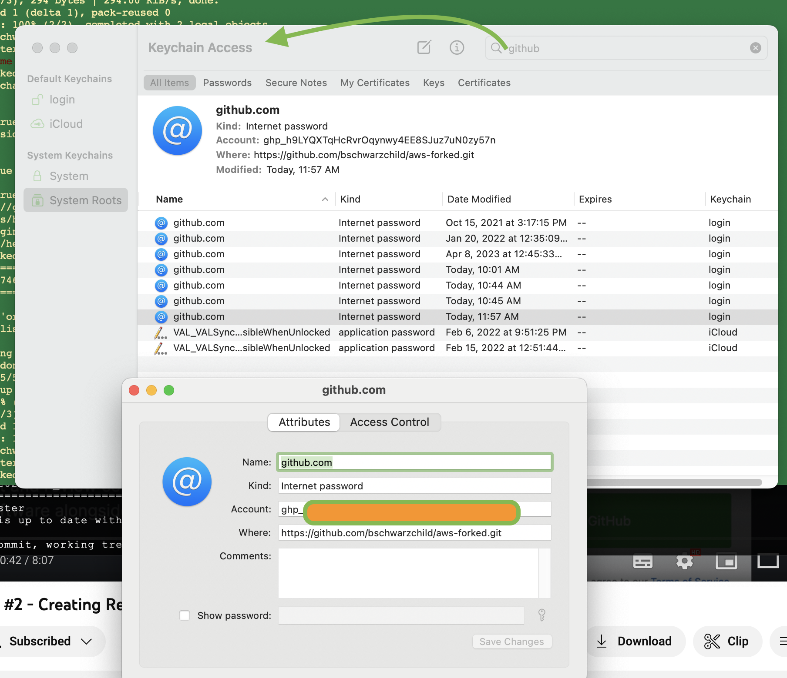

# My Github cheat sheet

## commons
git add .
git commit -m "yyyymmdd -xx comments"
git push origin master/main

git pull

git merge

## toss out everything and get from master
git reset --hard origin/master

## git pull and discard local changes
If you want remove all local changes - including files that are untracked by git - from your working copy, simply stash them:

git stash push --include-untracked

If you don't need them anymore, you now can drop that stash:

git stash drop

## removing cached creds (MacOS)
git config --global --unset user.password

## which git repo
git remove -v

## notes
- 2FA now enabled
- Use PAT (Personal Access Token) as pwd

## rebase history
git filter-branch --index-filter 'git rm -r --cached --ignore-unmatch files/workday workday_workers_20210322_233215_393292.txt' HEAD
### force option
git filter-branch --index-filter -f 'git rm -r --cached --ignore-unmatch files/workday workday_workers_20210322_233215_393292.txt' HEAD

git pull --rebase

## rebase (ghost large file; annoying)
git filter-branch --force --index-filter 'git rm --cached --ignore-unmatch brightoaks/fullsite_backup/backup-12.22.2010_23-03-18_thebrigh.tar.gz' --prune-empty --tag-name-filter cat -- --all

git pull --rebase

# useful urls
- https://medium.com/@ginnyfahs/github-error-authentication-failed-from-command-line-3a545bfd0ca8

## merge adf_collaborate to main
git clone <repo>
git branch 
git checkout main
git merge adf_collaborate
>Error
git pull origin adf_collaborate --allow-unrelated-histories
git status
sh gitupload.sh

## overwrite local changes
>Scenario: I worked on my personal Mac. I then want to get the changes from Git into my work Mac.
git fetch --all
git reset --hard origin/main
git pull

## Please tell me who you are
`git config --global user.email "someone@gmail.com"`
Or if you want only for local repo
`git config user.email "someone@gmail.com"`
Then proceed with git ops

## Ignoring files
From local repo:
`touch .gitignore` 

Open .gitignore and enter files to ignore:
- https://docs.github.com/en/get-started/getting-started-with-git/ignoring-files
- https://gist.github.com/octocat/9257657

Example:
`utils/lihim.py`
`*.class`

>But if file is already checked in and you want to ignore it, run:
`git rm --cached FILENAME`

## git authentication with PAT (bypass prompts at Raspi)
> Notes: https://cli.github.com/manual/gh_auth_login 

`type -p curl >/dev/null || (sudo apt update && sudo apt install curl -y)
curl -fsSL https://cli.github.com/packages/githubcli-archive-keyring.gpg | sudo dd of=/usr/share/keyrings/githubcli-archive-keyring.gpg \
&& sudo chmod go+r /usr/share/keyrings/githubcli-archive-keyring.gpg \
&& echo "deb [arch=$(dpkg --print-architecture) signed-by=/usr/share/keyrings/githubcli-archive-keyring.gpg] https://cli.github.com/packages stable main" | sudo tee /etc/apt/sources.list.d/github-cli.list > /dev/null \
&& sudo apt update \
&& sudo apt install gh -y`

> Run : `sudo gh auth login` then follow on-screen instructions

## Get logged in user
git config -l

## who is accessing github via terminal
ssh -vT git@github.com

## Clear and Refresh all creds globally
git config --global credential.useHttpPath true 

## Fix git commit error master--

## Add existing folder to git
- cd <localdir>
- git init
- git add .
- git commit -m 'message'
- git remote add origin https://github.com/bencarpena/LRMidland.git
- git push -u origin main
> optional: git push -f origin main

## Commit to existing branch ADF (data factory sample)
> - Scenario: from another data factory, restore the pipelines to another data factory residing in a different tenant
> - Copied and pasted invention_ adf folders [dataflow, dataset, linkedService, pipeline, trigger] to dfprod-bo
> - Executed the following git commandline scripts
> - pwd = /Users/benjcarpena/OneDrive/_Projects/Projects/LRMidland_DF/dfprod-bo/dfprod

- git checkout -b feature/20231226/api-low-code
- `copy in-scopen files /folders  manually`
- git add .
- git commit -m <message>
- git push origin feature/20231226/api-low-code

## show current branch
- git branch

## show all branches
- git branch -r

## show remote branch
- git remote show

## show history of commits and logs
- git log

## error RPC 
- RPC failed; curl 55 LibreSSL SSL_read: LibreSSL/3.3.6: error:1404C3FC:SSL routines:ST_OK:sslv3 alert bad record mac, errno 0

`git config http.postBuffer 524288000`

## restore previous commits
cd ~/git/your-repo-root
git log
find the commit id you want
git checkout `commitId` .

> Important note: the trailing . in the previous line is important! If you omit it, you will end up in a "detached HEAD" state, which you do not want here.

git commit -m "Restoring old source code"

## restore from main
cd ~/git/your-repo/
git checkout `new-dev-branch`
git reset --hard main
git push --force
