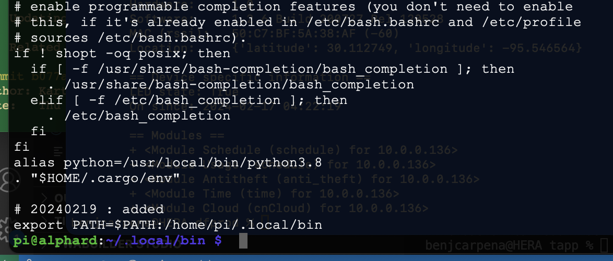

# Manage kasa devices
> Documentation here: https://github.com/python-kasa/python-kasa

## install
> Docs: https://pypi.org/project/python-kasa/

- Install : `pip3 install python-kasa`
    - Error encountered; needed to install Rust : `curl https://sh.rustup.rs -sSf | sh`
    - Install cryptography : `pip install cryptography==3.1.1`
    - Re-run `pip install python-kasa`
    - Add to path - https://www.redswitches.com/blog/path-variable-in-linux/#What-is-the-PATH-Variable-in-Linux
        - Current path is at /home/pi/.local/bin
        - `pi@alphard:~/.local/bin $ ./kasa`

### Fix for path:
    WARNING: The scripts pip, pip3, pip3.10 and pip3.8 are installed in '/home/pi/.local/bin' which is not on PATH.
    Consider adding this directory to PATH or, if you prefer to suppress this warning, use --no-warn-script-location.
    
1. Backup `~/.bashrc` file
2. `nano ~/.bashrc`
3. Add to last line `export PATH=$PATH:/home/pi/.local/bin`
4. Save file
5. Reload `source ~/.bashrc`

## discover
- `kasa discover`

## list all devices and their state
- `kasa state`

## turn on/off
- Turn on bulb (bed light): `kasa --host 10.0.0.161 on`
- Turn off bulb : `kasa --host 10.0.0.161 off`

## brightness
- Set brightness to 100% : `kasa --host 10.0.0.161 brightness 100`
- Set brightness to 10% in 5 sec transition : `kasa --host 10.0.0.161 brightness --transition 5000 10`

## color 
- hsv : `tbd`

## socket
- Turn on socket named 'blitzen' : `kasa --host 10.0.0.244 on --name 'blitzen'`
- Turn on socket named 'blitzen' : `kasa --host 10.0.0.244 on --name 'Olaf'`