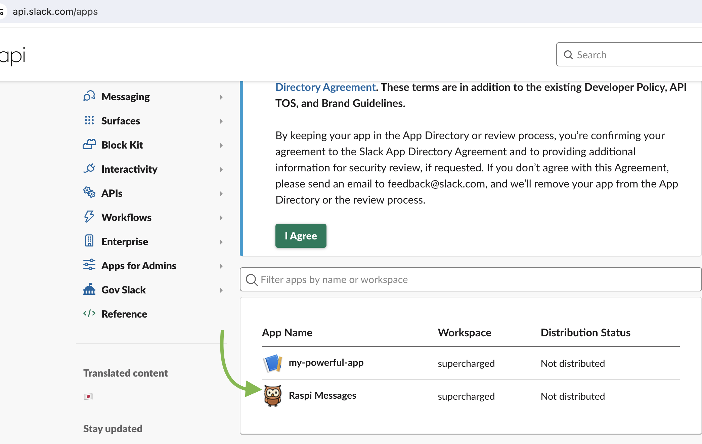
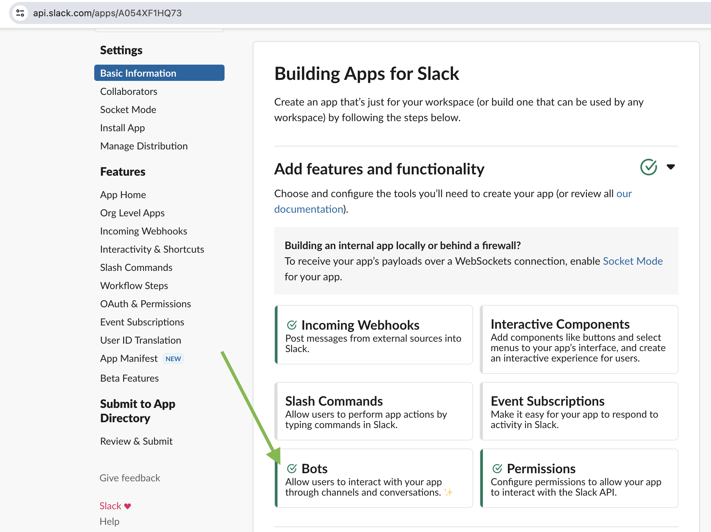
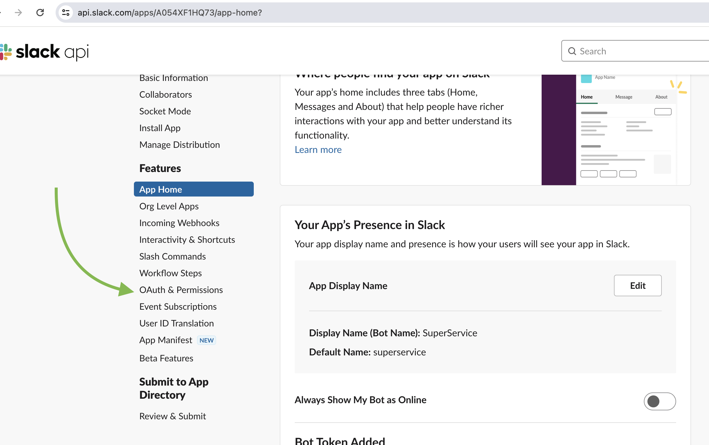
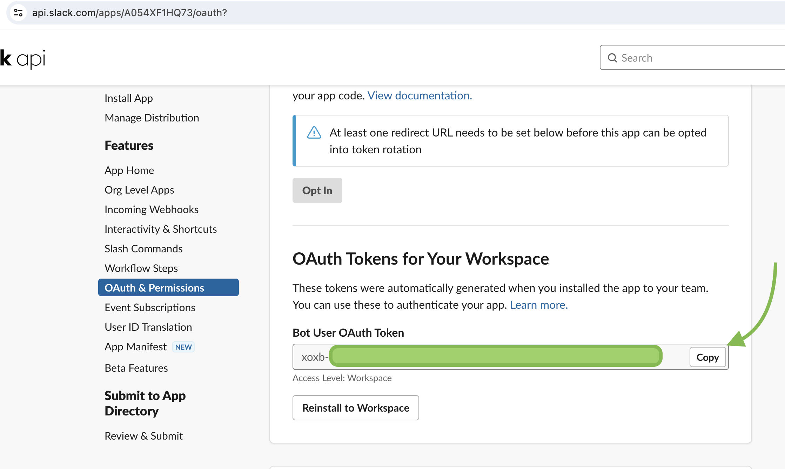
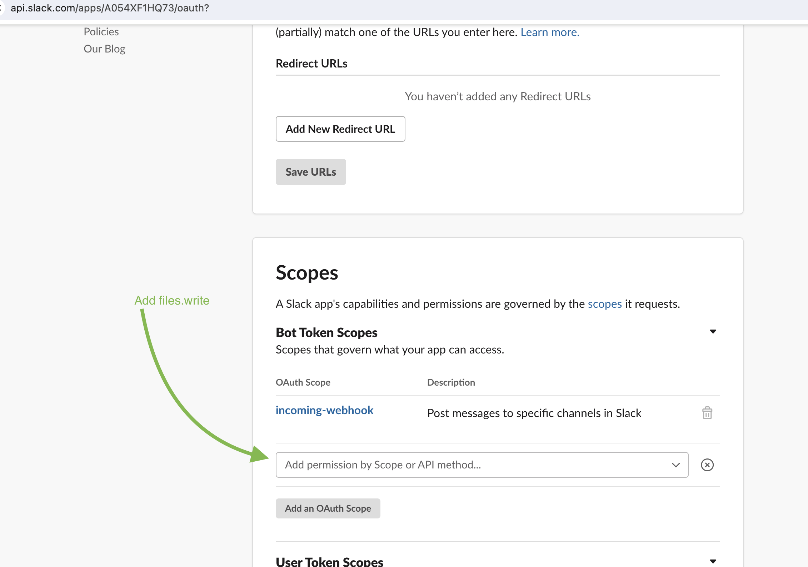
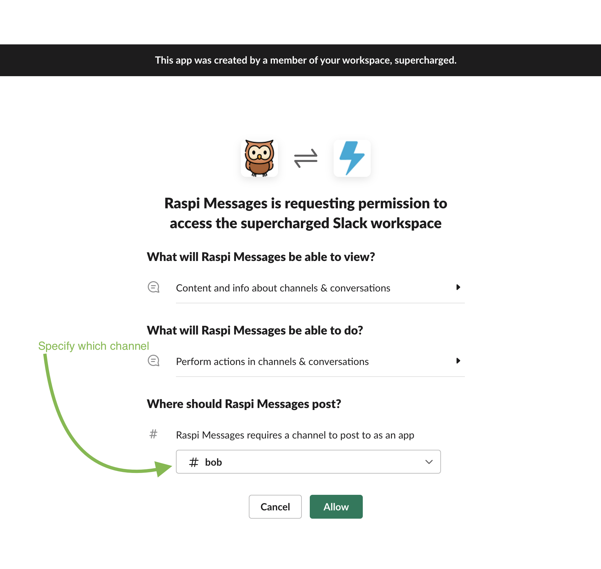
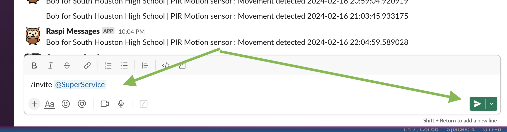
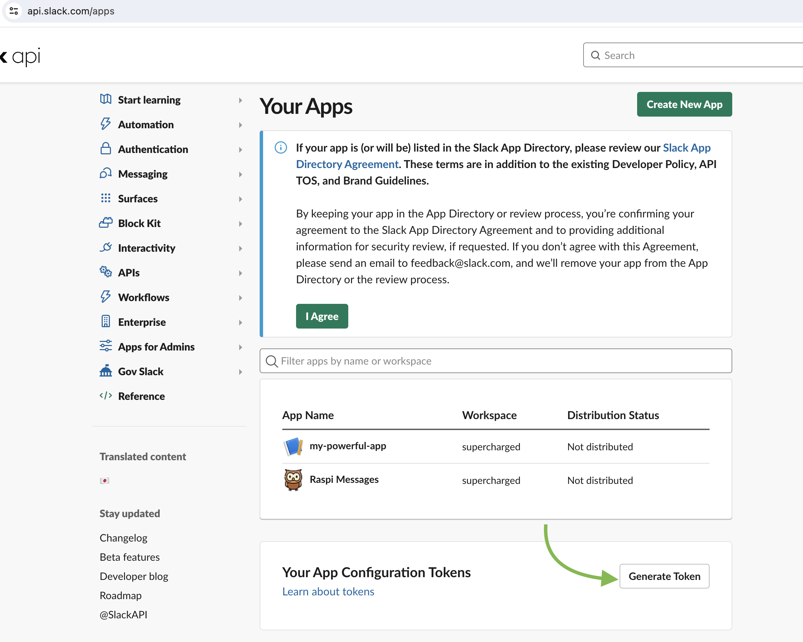

# My Slack cheat sheet

## Create bot token
- Go to https://api.slack.com/apps

Step 1
    

Step 2
    

Step 3
    

Step 4
    

Step 5 -  add scope
    

Step 6 - specify which channel
    

Step 7 - fix this error `The server responded with: {'ok': False, 'error': 'not_in_channel'}`
    

## Generate access token

- References: 
    - https://help.capenetworks.com/en/articles/2361824-creating-a-slack-api-token
    - https://api.slack.com/authentication/token-types#bot

## Go installed aps
- https://app.slack.com/apps-manage/T0558FTRAL8/integrations/installed

